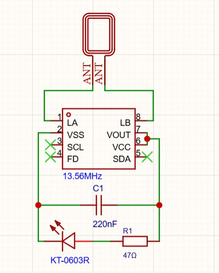
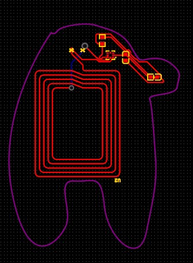
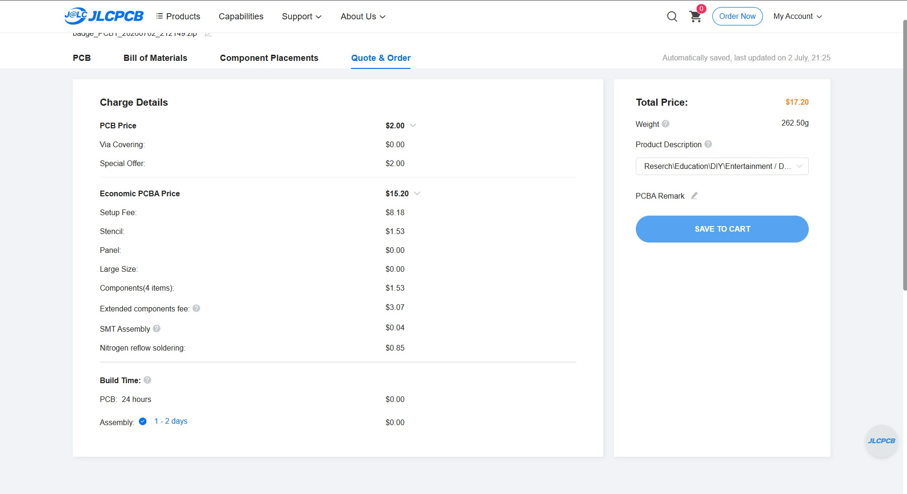

# Among Us Badge

A reprogrammable NFC badge that shows a "sus" look when NFC is connected

## Why?

It can be a fun thing to get people to scan your badge (and maybe your website!)

## Schematics

## PCB

## Order

## BOM

| Component       | Footprint                                | Name     |
| --------------- | ---------------------------------------- | -------- |
| CL10B224KA8NNNC | C0603                                    | 220nF    |
| KT-0603R        | LED-SMD_L1.6-W0.8-R-RD                   | KT-0603R |
| 0603WAF470JT5E  | R0603                                    | 47Ω      |
| NT3H2111W0FHKH  | XQFN-8_L1.6-W1.6-P0.50-BL_NT3H2111W0FHKH | 13.56MHz |

made by dave9123